# 利用 rclone 同步備份兩個 google drive 帳號

google drive 目前有提供 15gb 的免費空間提供大家使用，但是由於 google drive (GD) 分享邏輯為主分享者如果把檔案分享出去僅有分享使用權而已，一旦主分享者砍掉檔案大家都別玩。

所以獨立實體的備份就格外重要，最近玩到 rclone 發現可以玩的實在太多，搭配 google cloud platform (GCP) 就更把相關運用可以玩到極致，因為 GCP 備份 GD是算在網內流量，而且 GCP 還有一年 300 美金的免費試用，所以不少人用 rclone 來互向備份兩個 google drive 檔案。

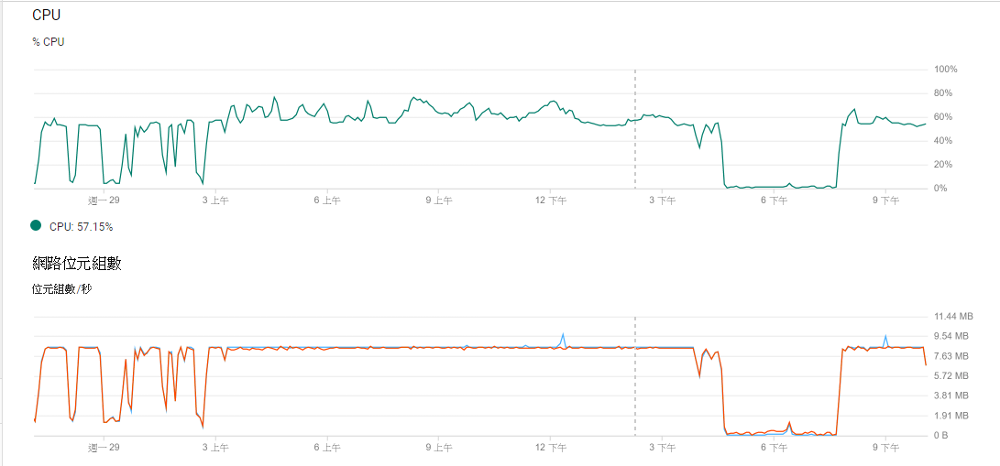

* 要注意的是 rclone 備份 gcp 有兩個重點限制超過以下限制大概就是等 24小時。

  API取用限制不可以超過：  

  1. Queries per day 1,000,000,000

  2. Queries per 100 seconds per user 1,000Queries per 100 seconds 10,000

* 每天帳號流量不可超過 750GB

## 開立自己獨立的 API

起手勢要有信用卡開 GCP 我就跳過，從開 API 開始其實很簡單，按圖說故事就好，**基本上我是一個 GD 帳號開一組 API 給他，反正不用錢**

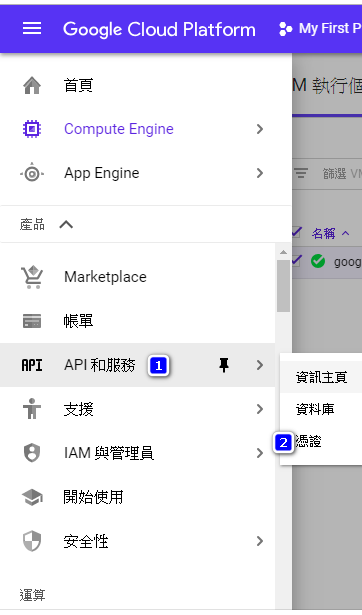
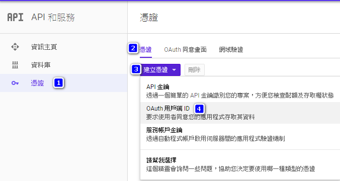
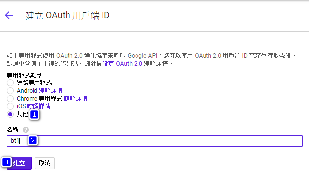

申請完成後會出現你的用戶端ID跟你的密鑰，這兩個等一下設定 rclone 要用的，記住可以的話一組 GD 設定一組 API，名稱你可以定好，方便辨識

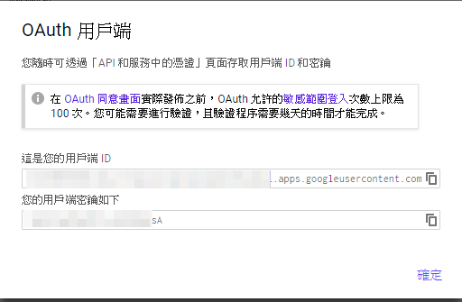

等你申請很多組後你就會看到跟我如下圖一樣，需要那一個就點那一個，取用所需的用戶端 ID 跟密鑰

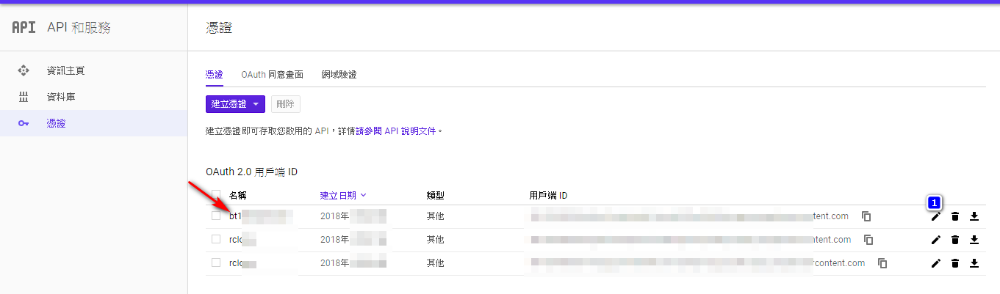
要注意的是記得在左邊第二個選項「資料庫」按下去，確認是不是有把 GD 的 API 啟用，如下圖
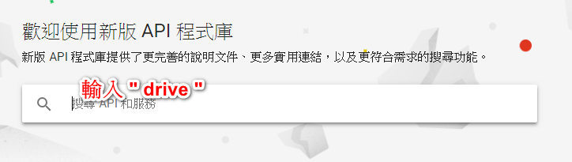

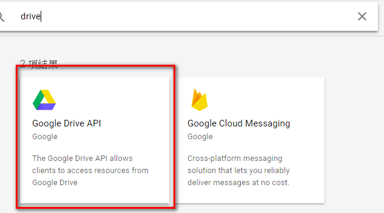

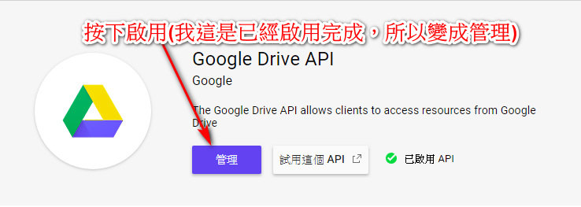

下一步為把 GD權限加入 API 中，選擇 Oauth同意畫面

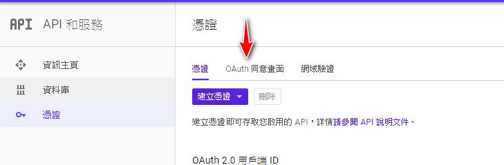

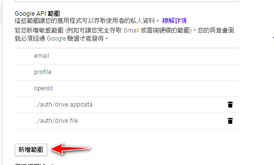

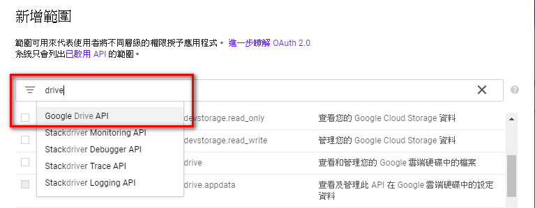

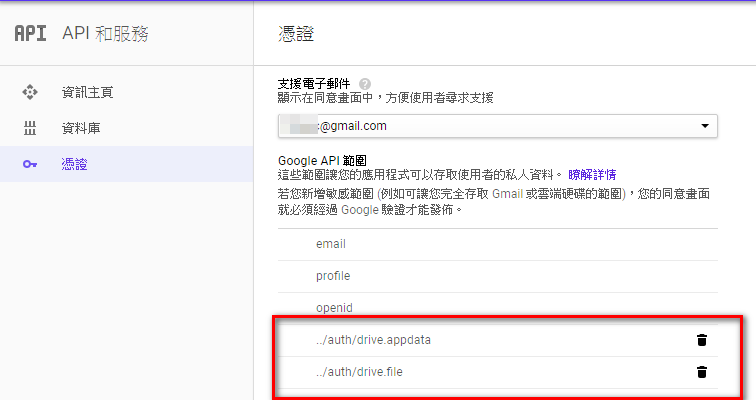

上面大概就是申請 API 的標準流程，其實不難，申請後就不用怕跟 rclone 作者用同一支 API，下面是我的 API 連線次數，給大家參考

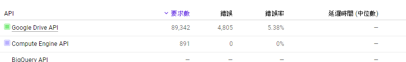

## 開始安裝 Rclone

再來就是進到自己的 GCP 的 VPS 中，其實 GCP 很簡單，直接用瀏覽器就可以用  SSH 進到 VPS 中，進到自己的主控台，按下 SSH 就跑出連線畫面，我是安裝 Ubuntu 開 1.7GB 的記憶體來用，主機放美西。

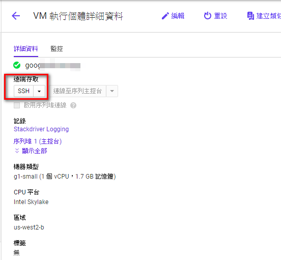

SSH進到主機最重要的是更新以及安裝軟體 “screen” 跟解壓縮軟體 7zip

```bash
sudo apt-get update&&sudo apt-get upgrade -y
sudo apt-get install screen -y
sudo apt-get install p7zip-full
```

[Rclone](https://rclone.org/downloads/) 官網裡面已經已安裝教學，很簡單只要打一個指令就可以

```bash
curl https://rclone.org/install.sh | sudo bash
```

然後就等他完成，完成後就是 rclone 設定的重頭戲

首先輸入，設定新GD帳號

```bash
rclone config
```

然後輸入  “n”

第一個是輸入名稱，取一個好記的，因為後面同步要輸入名稱，濫取名稱會很痛苦，甚至同步錯誤，下面圖片中的 zoo1 是我已經建立好的 GD

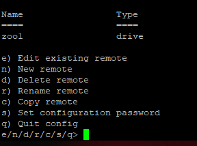

第二步就要輸入你要建立的服務， rclone 有超多功能， google Drive 是在第12個，不要選錯。

第三步就要輸入剛剛已經建立的 google API 的資料， Client Id 就貼上 API 中的”用戶端 ID”， Client_secret就貼上 “密鑰” ，然後按下確定進行下一步
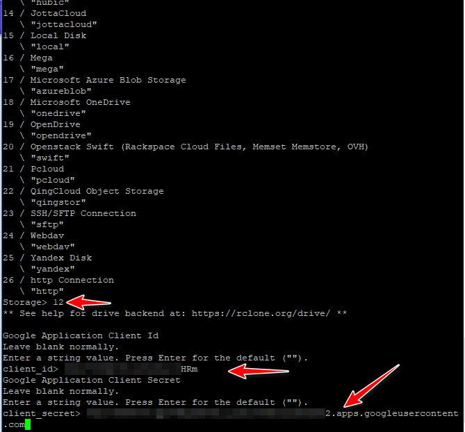

再來就是設定讀取權限，我設定的邏輯如下，可以依你的需求進行設定，要兩個都寫入也可以。

* 「主要帳號」     ：選擇 “2” 唯讀，不給程式寫入
* 「被同步帳號」：選擇 “1”  可以寫入以及讀取

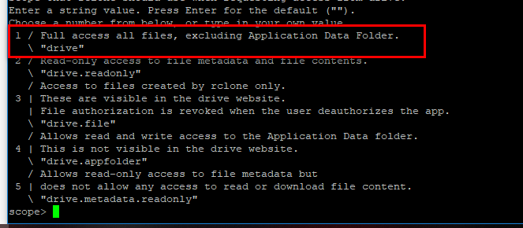

再來下一步可以一直按下 enter 使用預設即可，但是注意選項 （可以看下圖）

”  EDIT Advance config ” 出現時要輸入 “N”

” Use auto config ” 出現時也是輸入 “N”

後續會出現一段認證網址，請用滑鼠選取就好，SSH 會自動複製（千萬不要按下右鍵或是 Ctrl + C 會跳出設定），把連結貼到瀏覽器，他會出現 GD 的認證，認證後會給你一段認證碼，請把網頁上認證碼複製，到 SSH 中用 Ctrl + V 貼上按下 Enter 就好，後面就可以一直 “y” 到完成。

這個流程如果有兩個 GD 帳號要設定兩次，以此類推。

設定完成後就可以開始準備同步，假設我主帳號是 zoo1，想要把 zoo1 裡面的帳號同步到 zoo2 中，那我的指令很簡單

首先輸入 ” screen ” 開一個背景工作，讓同步作業在背景跑，相關的用法可以 google 一下

之後輸入

```bash
rclone copy --drive-chunk-size=64M --transfers=4 --fast-list --stats=10s -v zoo1: zoo2: --bwlimit=8M
```

上面指令大概說明一下

* zoo1: zoo2: （zoo1:    記得要加冒號，就是剛剛設定的 GD 帳號，前面那一個是主帳號 copy 到 zoo2 去
* zoo1:movie/ zoo2:movie（當然你可以用資料夾都沒關西，這樣就是 zoo1 下的 movie資料夾中的檔案全部都複製到 zoo2下movie資料夾，如果 zoo2 資料夾不存在，rclone會自動幫你開新資料夾）
* /movie zoo2:movie (這個是把 VPS 下面的 movie 資料夾 copy 到 zoo1 中 movie 資料夾，這個對於有在玩盒子的人根本神器)  

  rclone copy –drive-chunk-size=64M –transfers=4 –fast-list –stats=10s -v /movie zoo2:movie/ –bwlimit 8M
* –transfers=4 （同時4個檔案傳輸，太大會被 google 停止）
* –stats=10s -v （10秒回傳一次傳輸訊息）
* –bwlimit 8M（因應每天 750G 的限速，你可以不信邪把這個參數拿掉測試看看）

以上大概就是 rclone 的用法，下面是實際使用圖面，祝大家使用愉快

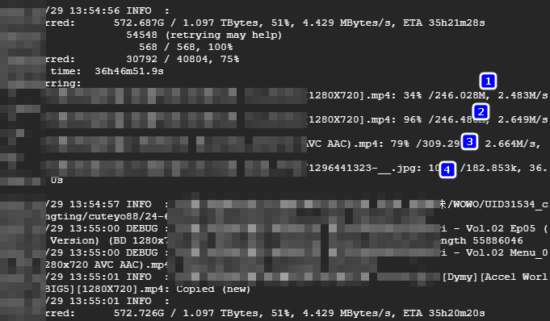
