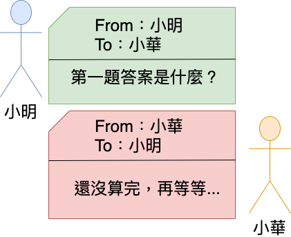
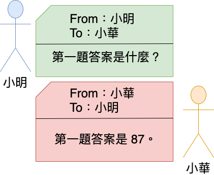
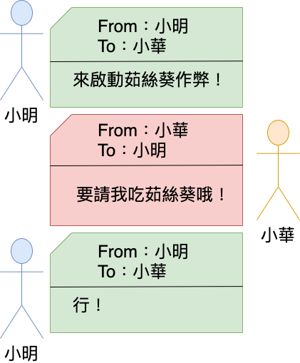
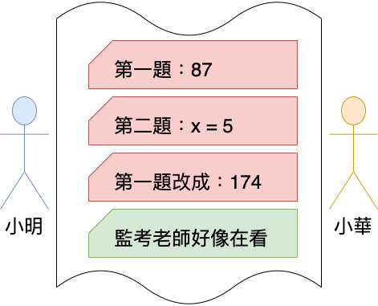
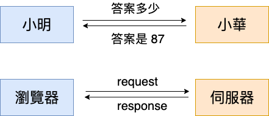
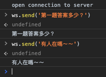
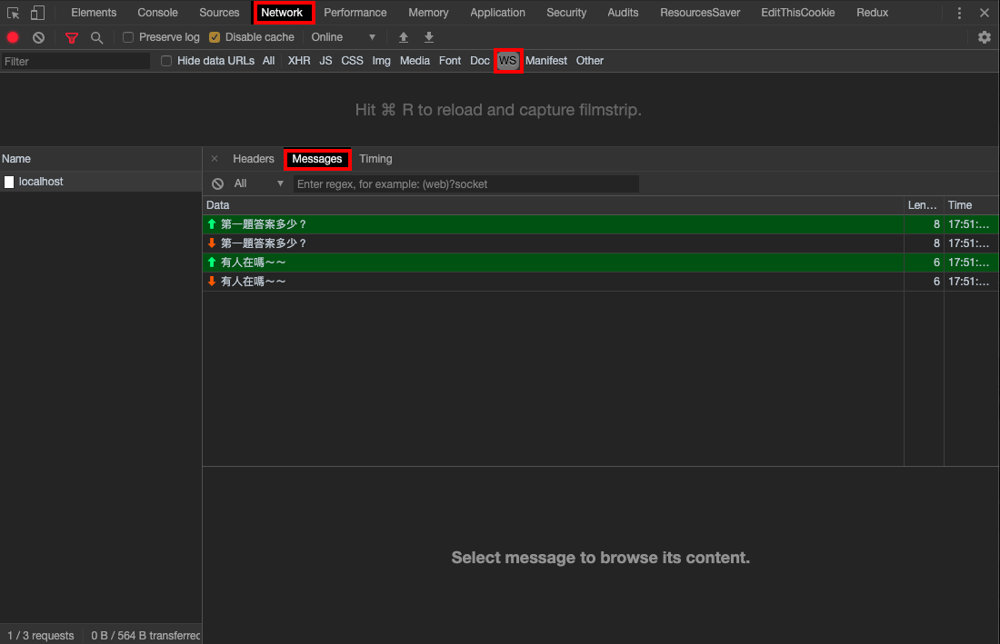

# 用傳紙條作弊理解 WebSocket


什麼是 WebSocket？

或許你以前從來沒聽過 WebSocket，但其實在我們生活中使用的許多網頁或多或少都應用上了這個技術，舉 Facebook 為例，像是其中的聊天室、訊息通知、其他朋友回應動態後自動長出新的回應等等，無處不見 WebSocket 的蹤影，那它到底是什麼東西呢？

如果直接把 WebSocket 拿去 google，可能會從維基百科、MDN 或是一些摘要技術文得到像是這樣的內容：

> - WebSocket 是一種網路傳輸協定，可在單個 TCP 連接上進行全雙工通訊，位於 OSI 模型的應用層。
> - WebSocket 是一種讓瀏覽器與伺服器進行一段互動通訊的技術。使用這項技術的 Webapp 可以直接進行即時通訊而不需要不斷對資料更改進行輪詢（polling）。

若上面這些敘述你都看得懂，那恭喜你，你可能已經大致了解 WebSocket 是什麼了；但如果你一看到這些資訊仍無法理解，那麼你可能可以透過這篇文章中的一個「傳紙條作弊」的小故事來理解。

第一次寫這種技術白話文，剛好看到 Huli 大大之前在「[從傳紙條輕鬆學習基本網路概念](https://medium.com/@hulitw/learning-tcp-ip-http-via-sending-letter-5d3299203660)」中透過傳紙條及幾個生活化的例子介紹 TCP/IP 四層模型，就借用「傳紙條」這個概念來介紹 WebSocket 吧！

## 小明的台大特訓班

故事要從一個正在高三模擬考、複習考、月考、小考地獄中水深火熱的考生小明開始說起。

小明是班上的吊車尾，自從上了高三後，隔壁班的小美說跟著他沒前途，就把他甩了，受到刺激的小明決定奮發向上以台大為目標，向小美證明他是一個有抱負的青年。

但小明一時之間也準備不了這麼多的學科，尤其是他最不拿手的數學，於是他找上了他的天才好朋友小華，想請小華幫他在數學模擬考時作弊。

但吝嗇的小明只答應每次考試後請小華吃呷足飽平價牛排，小華雖然覺得平價牛排很普，但念在那間店有免費飲料吧、冰淇淋吃到爽就答應了。

不過心不甘情不願的小華制定了作弊的條件是小明考試時有問題，再自己傳紙條過來問，他不會主動提供答案。

### 小明的作弊初體驗

在小明所處的那個年代，高中生們普遍都沒有手機，因此只能使用最傳統的傳紙條，你可能會問考試時傳紙條不是很容易被老師發現或是被正義魔人檢舉嗎？

沒有，在小明的學校中老師監考時都在閉目養神，同學們都是好人，一切都非常 peace，這也讓小明可以放心的傳紙條作弊。

數學模擬考正式開始，小明一拿到考卷後就傳出了一張紙條，向小華詢問第一題的答案。小華收到紙條後因為還沒有算完第一題，所以在回傳的紙條中告訴小明他還沒算完。



尷尬的小明只能繼續等，急性子的他一分鐘後又送出了紙條詢問第一題的答案。小華也剛好飛快的算完了，所以回傳了答案給他，收到答案的小明也很開心的把答案寫到了考卷上，馬上傳出了另一張紙條想詢問第二題的答案。



就這樣一來一回之下，他們兩個終於辛苦地完成了這場考試。

隔天成績公佈了，小華不出預料的又拿了 100 分，但小明卻只有 58 分，不可置信的小明馬上在下課時衝去問小華為什麼故意給他錯的答案。

小華一邊剔著昨天吃呷足飽平價牛排的肉渣一邊說：「哦！沒有啊，阿我後來發現算錯了，所以就重新算了一遍，但我算完後你沒有再傳紙條來問這一題答案呀，不4我的錯。」

小明眉頭一皺，發現原本制定的規則好像不太適用在作弊這件事上，不僅要每過幾分鐘就傳一張紙條過去問小華算好了沒，除了很浪費紙之外，也怕太頻繁還是會被監考老師發現；而最麻煩的還是當小華如果算錯修改了答案他若是沒傳紙條再問他一次，就會造成他寫在考卷上的答案是錯的。

### 小明的作弊策略改良版

苦惱的小明想到了一個辦法，於是去向小華重新討論作弊的方式，他提議在下一次的數學考試中，若是小華算好了答案或是修改了答案，都由小華主動通知小明，當然為了讓小華提高意願做這件事，小明願意將呷足飽平價牛排升等為茹絲葵，聽到茹絲葵的小華也二話不說就答應了。

在下一次的考試開始後，一開始小明會傳紙條過去：



於是確認過這次考試有茹絲葵吃的小華，也心甘情願地遵守承諾。當他完成答案後，就主動把小抄傳給小明；另外當他覺得原本的答案有疑慮時重新計算後，也主動將修改好的答案傳給小明，當然小明有什麼想跟小華說也可以主動傳過去。




就這樣小明在下一次的成績公佈時，也順利的拿到了一百分，小華也終於吃到人生中第一客的茹絲葵牛排，於是兩人就這麼合作無間的一路順利的考上了台大，可喜可賀！可喜可賀！

至於小明有沒有重新挽得美人歸，那又是另一段故事了...

## 故事中對應到的 WebSocket 概念

從上面的故事中拉回到今天要講的 WebSocket 身上，故事中小明與小華的關係就像是在網路世界中 client 向 server 要資料的關係。



參考上圖，可以想像小明是我們的**瀏覽器**，小華是網頁的**伺服器**，而小明的考卷可以說是**網頁畫面**，小華的答案是**伺服器處理後的資料**。

其中**紙條**扮演很重要的角色，網路上的許多概念都可以用傳紙條來闡述，就是因為這裡的紙條指的是網路概念中的**封包**概念，換句話說就是「傳遞的訊息」，基本上兩個概念非常接近，所以是個比較容易理解的比喻。

### HTTP 的限制

而在故事中小明一開始與小華議定的**平價牛排規則**可以說是我們常聽到的 **HTTP 通訊協定**。

因為 HTTP 協議的限制，一般只能由 client 端發送請求，server 端送回查詢結果。在這樣的限制之下，假如 server 今天有連續的狀態變化，要讓 client 得知就非常麻煩。

就像故事中因為小華是持續在計算答案，在不確定他什麼時候算完或者什麼時候做出了修改，小明就不能保證考卷上的答案是不是正確的。

這種情況應用到一般許多網頁都常常發生，像是運動比賽的比數、股市報價、天氣變化、對戰遊戲中的敵人血量等等，這些資訊都具有連續性的變化。

若是遵從 HTTP 的限制，只在第一次頁面載入完成就不再變更資料，都會讓使用者得到沒更新過的資料，在早期想要知道最新的資訊甚至只能自己很傳統的不斷按著重新整理來確保資料是最新的，然後當網速很慢或者流量塞爆時就會等的很痛苦。

### 輪詢（polling）

於是在 Web 技術的發展中，許多網站為了要實現這種可以由 server 推播訊息的技術，一開始都是採用 polling 的作法。

什麼是 polling 呢？顧名思義就是**每隔一段時間由 client 端去向 server 發出 HTTP request 詢問狀態變化**，用以達到可以在 client 端即時顯示正確的資訊。

就像是故事中小明最一開始要每隔一分鐘就傳紙條過去問小華答案的方式，這就是 polling，可以很容易地感覺到這是個非常的沒效率且比較不聰明的方法。

以生活實際上的例子的話，像是以前比較舊式的運動比數或股市報價網站，有些在畫面上都會有一個 **10 秒後頁面自動重整**的提示，這就是所謂的 polling，透過刷新頁面或是說每隔一段時間重新向 server 發送 request 來確保網站內容能持續更新。

這樣不斷的向 server 發 request，不僅效率很差也很浪費資源，因為有時候 server 的資料根本還沒有改變，就像小華根本還沒把答案算完一樣。

### WebSocket 的出現

於是後來有人想到了一個解法，這個解法就是 WebSocket。

WebSocket 是另一種網路協定，與 HTTP 是平等的關係，就像是故事中茹絲葵協議與平價牛排協議是對應的關係。

2008 年時，HTML5 制定了 WebSocket 協定，透過原本的 TCP 協定上（這個 TCP 可以理解為一種保證紙條傳得到的規則），先在起初的握手階段使用 HTTP 建立連線，接著就可以透過 WebSocket 在單個 TCP 連接上，進行**雙向的通訊**，解決了 HTTP 協定中  server 端不能主動向 client 推播訊息的痛點。

就像故事中的小華接受了茹絲葵規則，可以主動向小明傳遞紙條的概念一樣。

而其中 WebSocket 還有一些優點，其中像是建立雙向連線後， server 傳給 client 的封包 header 比原本的 HTTP 還要小，這部分也增加了在即時性更新的優勢。

## WebSocket 整理

幫大家整理幾個 WebSocket 的重點：

- 因為 HTTP 限制，server 無法主動向 client 傳遞即時的資訊。
- 在 HTTP 限制下使用 polling 解決這個問題，但效率不好也浪費資源。
- 使用 WebSocket 後，可以由 server 主動向 client 推播資訊，讓 client 與 server 能進行雙向溝通。

也因為 WebSocket 能讓 client 與 server 進行雙向溝通，所以這個技術就普遍的被應用在許多現代的網頁當中，最常見的應該就是聊天室了，許多 client 之間可以互相溝通的原因就是，server 在收到 A 傳過來的訊息後，可以向聊天室中的其他人廣播說 A 說了什麼。

而其他比較常見的應用像是最一開始提到在 Facebook 中的通知，甚至是網頁遊戲中若是有任何對戰成份在，要即時知道對方做了什麼操作，也是要依賴 WebSocket 才做得到。

說了這麼多，最後我們實際來寫一個簡單的小程式，實驗看看在網頁中怎麼做 WebSocket 吧！

## WebSocket 實作

這邊我們來簡單做一個 WebSocket echo service，顧名思義就是 client 傳訊息過去 server，由 server 將這段訊息像回聲一樣再傳回來。

首先先用 Node.js 架設一個 socket server，先安裝需要的套件：

```shell
npm install express
npm install ws
```

`express` 是 Node.js 的開發框架，而 `ws` 是在 Node.js 中開發 WebSocket 最泛用的套件。

再來就可以寫一支 `server.js`：

```javascript
const express = require('express')
const wsServer = require('ws').Server

const PORT = 5566

// 建立 express 物件並綁定在 port 5566
const server = express().listen(PORT, () => {
  console.log(`Listening on ${PORT}`)
})

const wss = new wsServer({ server })

// 監聽是否有新的 client 連上線
wss.on('connection', ws => {
  console.log('One client has connected.')

  // 監聽 client 傳來的訊息後，再將訊息傳回去
  ws.on('message', data => {
    ws.send(data)
  })

  // 監聽 client 是否已經斷開連線
  ws.on('close', () => {
    console.log('One client has disconnected.')
  })
})
```

再來寫一個測試網頁當作 client 端，先建立一個空的 html 檔並引入 `client.js`，在 `client.js` 中寫入以下內容：

```javascript
// 建立一個 WebSocket 物件，並連上 socket server
const ws = new WebSocket('ws://localhost:5566')

// 連線建立後
ws.onopen = () => {
  console.log('open connection to server')
}

// 連線斷開後
ws.onclose = () => {
  console.log('close connection to server')
}

// 收到 server 事件時，將事件中的訊息印出來
ws.onmessage = event => {
  console.log(event.data)
}
```

這邊在最一開始先建立一個 WebSocket 物件，傳入的是 socket server 的網址，可以注意到原本在 HTTP 網址中我們會寫 `http://......`，在 WebSocket 中同理就是將 `http` 改成 `ws` 就可以建立 WebSocket 連線，相對應要建立安全連線就將 `https` 改成 `wss`。

簡單幾步就完成 WebSocket echo service 的測試囉，可以說是一個 WebSocket 中的 hello world，接下來實際上打開網頁測試：



從 console 中會看到網頁連上 socket server 後有印出連線成功的訊息，再來直接使用 `ws.send()` 來發送訊息，也可以成功收到來自 server 的回聲。

這個程式再稍微將 server 收到訊息的部分改造一下，將回聲的部分改為將訊息廣播給所有 client，就能變成一個多人聊天室囉，有興趣可以自己挑戰一下！

另外這邊也補充一下，在 Chrome dev tools 中檢查 WebSocket 資訊的作法：



如上圖可以切到 Network 下面的 `WS` tab，可以過濾出 WebSocket 相關的網路連線哦，可以看到在 message 中有剛剛 client 與 server 訊息交換。

## 總結

在這篇文章中利用一個作弊傳紙條的小故事協助大家理解什麼是 WebSocket，並簡述了關於 WebSocket 的幾點特性：

- 因為 HTTP 限制，server 無法主動向 client 傳遞即時的資訊。
- 在 HTTP 限制下使用 polling 解決這個問題，但效率不好也浪費資源。
- 使用 WebSocket 後，可以由 server 主動向 client 推播資訊，讓 client 與 server 能進行雙向溝通。
- WebSocket 常見的應用有聊天室、即時動態資料網頁、對戰遊戲等。

最後也簡單實作了一個關於 WebSocket 的回聲小程式，實際體驗一下如何寫一個 WebSocket 的 hello world。

希望以上的內容能更輕易地理解什麼是 WebSocket，文章內容若是有任何的錯誤或可以修改的更好的地方，都歡迎留言或私訊我，感謝！


## 參考資料與延伸閱讀

- [WebSocket](https://zh.wikipedia.org/wiki/WebSocket) @ 維基百科
- [從傳紙條輕鬆學習基本網路概念](https://medium.com/@hulitw/learning-tcp-ip-http-via-sending-letter-5d3299203660) @ Huli
- [WebSocket 教程](https://www.ruanyifeng.com/blog/2017/05/websocket.html) @ 阮一峰的网络日志
- [JavaScript | WebSocket 讓前後端沒有距離](https://medium.com/enjoy-life-enjoy-coding/javascript-websocket-讓前後端沒有距離-34536c333e1b) @ 神Q超人

## 文章來源

- [用傳紙條作弊理解 WebSocket - DezChuang](https://gist.github.com/DezChuang/ef805f67c862850d3d75537c9e073812)